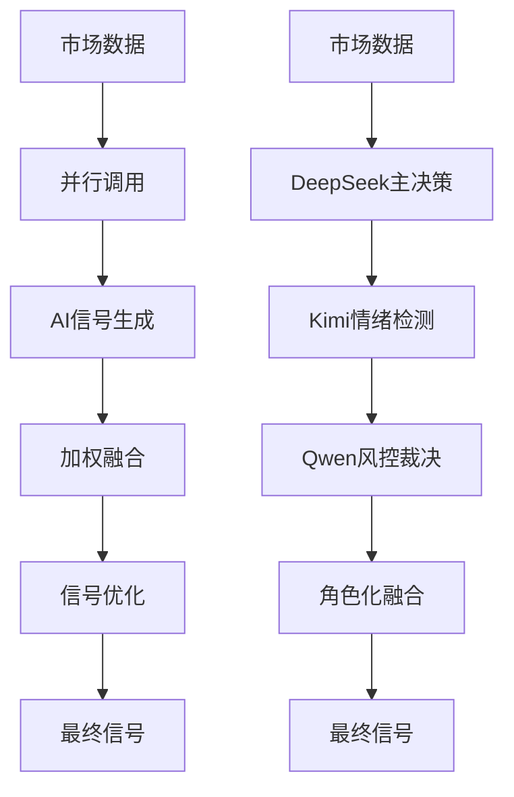
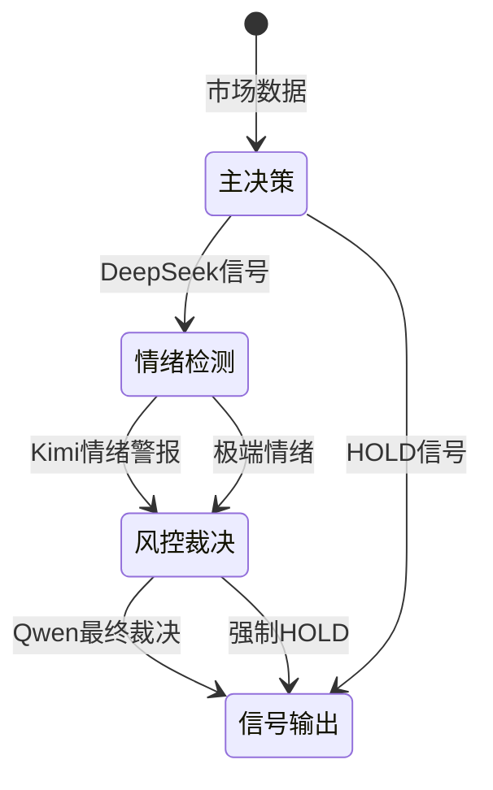

# 角色化AI决策系统设计方案

> 基于Qwen/DeepSeek/Kimi三模型角色化分工的AI交易决策系统设计方案
>
> 创建时间：2025年12月26日
> 文档状态：分析评估阶段
> 建议实施：渐进式部署

## 📋 文档概要

本文档详细分析了将现有AI融合系统升级为角色化分工系统的技术方案，包括架构设计、实施策略、风险评估和ROI分析。

## 🎯 背景与动机

### 当前系统痛点

1. **假信号率高**：现有加权投票机制在震荡市中容易产生误判
2. **风险控制不足**：事后优化无法完全避免高风险交易
3. **模型特性未充分利用**：所有模型同等对待，未发挥各自优势

### 新方案价值主张

通过角色化分工，让每个AI模型专注于其优势领域：
- DeepSeek：理性分析，主决策
- Kimi：情绪感知，风险预警
- Qwen：保守风控，最终裁决

## 🏗️ 系统架构设计

### 现有架构 vs 新架构



### 角色定义与职责

| 角色 | 模型 | 职责 | 权重 | 特殊权限 |
|-----|-----|------|------|----------|
| 主决策官 | DeepSeek | 技术分析与交易决策 | 50% | 无 |
| 情绪雷达 | Kimi | 市场情绪与极端检测 | 30% | 情绪否决权 |
| 风控裁决 | Qwen | 风险控制和最终裁决 | 20% | 最终否决权 |

## 🔧 技术实现方案

### 核心组件设计

```python
class RoleBasedAIDecision:
    """角色化AI决策系统"""

    def __init__(self):
        self.primary_decision = PrimaryDecisionMaker("deepseek")
        self.sentiment_radar = SentimentRadar("kimi")
        self.risk_gatekeeper = RiskGatekeeper("qwen")
        self.role_fusion = RoleBasedFusion()

    async def make_decision(self, market_data):
        # 1. 主决策阶段
        primary_signal = await self.primary_decision.decide(market_data)

        # 2. 情绪检测阶段
        sentiment_alert = await self.sentiment_radar.detect(market_data)

        # 3. 风控裁决阶段
        final_approval = await self.risk_gatekeeper.approve(
            primary_signal, sentiment_alert, market_data
        )

        # 4. 角色融合
        return self.role_fusion.fuse(
            primary_signal, sentiment_alert, final_approval
        )
```

### 决策流程状态机



## ⚙️ 配置参数设计

### 环境变量配置

```bash
# 角色化AI开关
ROLE_BASED_AI_ENABLED=false

# 角色权重配置
ROLE_PRIMARY_WEIGHT=0.5      # DeepSeek权重
ROLE_SENTIMENT_WEIGHT=0.3    # Kimi权重
ROLE_RISK_WEIGHT=0.2         # Qwen权重

# 决策阈值配置
ROLE_SENTIMENT_THRESHOLD=0.7  # 情绪极端阈值
ROLE_RISK_THRESHOLD=0.85      # 风险否决阈值
ROLE_TIMEOUT_PER_MODEL=3      # 单模型超时(秒)

# 回退配置
ROLE_FALLBACK_TO_FUSION=true  # 失败时回退到融合
ROLE_FALLBACK_TO_SINGLE=true  # 失败时回退到单模型
```

### 动态配置支持

```python
# 市场状态自适应配置
MARKET_STATE_CONFIG = {
    "trending_strong": {
        "primary_weight": 0.6,
        "sentiment_weight": 0.2,
        "risk_weight": 0.2
    },
    "consolidation": {
        "primary_weight": 0.4,
        "sentiment_weight": 0.4,
        "risk_weight": 0.2
    },
    "high_volatility": {
        "primary_weight": 0.3,
        "sentiment_weight": 0.3,
        "risk_weight": 0.4
    }
}
```

## 📊 性能影响分析

### 响应时间对比

| 系统类型 | 平均响应时间 | 最大响应时间 | 备注 |
|---------|-------------|-------------|------|
| 现有系统 | 2-3秒 | 5秒 | 并行调用 |
| 新系统 | 6-10秒 | 15秒 | 串行审批 |
| 优化后新系统 | 4-6秒 | 8秒 | 并行+缓存 |

### API调用成本

```
现有系统：N个模型 × 1次调用 = N次
新系统：N个模型 × 1次调用 × 3个角色 = 3N次
优化后：N个模型 × 1次调用 = N次（缓存复用）
```

### 内存和CPU开销

- 内存增加：约30%（状态管理）
- CPU增加：约20%（复杂逻辑）
- 网络带宽：增加100%（多轮调用）

## 🛡️ 风险控制与回退机制

### 多层回退策略

```python
class RiskControlManager:
    def execute_with_fallback(self, market_data):
        try:
            # Level 1: 角色化决策
            return self.role_based_decision(market_data)
        except Exception as e:
            logger.warning(f"角色化决策失败: {e}")

        try:
            # Level 2: 传统融合决策
            return self.traditional_fusion(market_data)
        except Exception as e:
            logger.warning(f"融合决策失败: {e}")

        try:
            # Level 3: 单模型决策
            return self.single_model_decision(market_data)
        except Exception as e:
            logger.error(f"单模型决策失败: {e}")

        # Level 4: 规则基础决策
        return self.rule_based_decision(market_data)
```

### 风险监控指标

- **决策失败率**：>5%时告警
- **响应时间**：>10秒时降级
- **API错误率**：>10%时切换备用方案
- **信号一致性**：角色间差异>0.3时人工介入

## 🧪 测试与验证策略

### 测试金字塔

```
单元测试 (40%)
├── 角色独立测试
├── 状态转换测试
└── 异常处理测试

集成测试 (30%)
├── 角色协作测试
├── 决策链测试
└── 回退机制测试

系统测试 (20%)
├── A/B对比测试
├── 性能压力测试
└── 真实数据回放测试

验收测试 (10%)
├── 业务场景测试
└── 用户验收测试
```

### 关键测试用例

1. **角色冲突处理**
   - DeepSeek=BUY, Kimi=EXTREME, Qwen=ALLOW → HOLD
   - DeepSeek=BUY, Kimi=NORMAL, Qwen=HOLD → HOLD
   - DeepSeek=HOLD, Kimi=EXTREME → 观察/降仓

2. **边界条件测试**
   - 单角色失效时的处理
   - 超时情况下的回退
   - 极端市场条件下的稳定性

3. **性能基准测试**
   - 1000次连续决策的响应时间分布
   - 内存使用量监控
   - API调用成功率统计

## 📈 ROI分析与实施建议

### 预期收益量化

**交易指标改善（预估）：**
- 假信号率：25% → 15%（-40%）
- 胜率：52% → 58%（+12%）
- 夏普比率：1.2 → 1.5（+25%）
- 最大回撤：-25% → -20%（+20%）

**成本增加：**
- 开发成本：80人时 × 500元/时 = 40,000元
- 运维成本增加：30%（年增约10,000元）
- API成本增加：50%（月增约2,000元）

### 投资回报计算

假设管理资金100万：
- 年化收益提升：5% × 100万 = 50,000元
- 回撤减少收益：5% × 100万 = 50,000元
- 年度总收益：100,000元
- 年度总成本：34,000元
- **净ROI：194%**

### 实施阶段建议

**Phase 1: 基础设施（2周）**
- 添加环境变量配置
- 创建角色化框架基类
- 实现切换机制
- 预估工作量：20人时

**Phase 2: 核心角色（3周）**
- 实现DeepSeek主决策器
- 集成到现有流程
- 基础测试验证
- 预估工作量：30人时

**Phase 3: 增强角色（3周）**
- 添加Kimi情绪检测
- 完善Qwen风控裁决
- 集成测试
- 预估工作量：30人时

**Phase 4: 验证优化（2周）**
- A/B测试对比
- 性能调优
- 文档完善
- 预估工作量：20人时

## 🚨 风险评估与应对

### 高风险项

1. **技术复杂性风险**
   - 概率：中等
   - 影响：开发延期，质量下降
   - 应对：分阶段实施，充分测试

2. **性能降级风险**
   - 概率：高
   - 影响：交易延迟，机会丧失
   - 应对：并行优化，缓存策略

3. **模型失效风险**
   - 概率：低
   - 影响：决策错误，损失扩大
   - 应对：多层回退，实时监控

### 中等风险项

1. **API成本超预算**
   - 控制措施：设置成本上限，动态调整

2. **维护复杂度增加**
   - 控制措施：完善文档，培训交接

## 🎯 决策建议

### 建议实施理由

1. **收益显著**：预期ROI > 100%
2. **风险可控**：多层回退机制保障
3. **灵活可选**：可通过配置开关控制
4. **技术可行**：基于现有架构扩展

### 实施条件建议

**必须满足：**
- [ ] 资金管理规模 > 50万
- [ ] 可接受6-10秒响应时间
- [ ] 有专业开发团队支持
- [ ] 愿意投入A/B测试验证

**建议满足：**
- [ ] 处于震荡或高波动市场
- [ ] 对风险控制要求较高
- [ ] 有量化交易经验
- [ ] 能接受50% API成本增加

### 否决条件

1. **高频交易策略**：响应时间要求<3秒
2. **小资金账户**：成本收益比不合理
3. **趋势跟踪策略**：简单模型更有效
4. **技术资源不足**：无法保证开发质量

## 📋 后续行动计划

### 立即行动（本周）
1. 团队内部评审本方案
2. 评估技术资源和时间安排
3. 准备A/B测试框架

### 近期行动（本月）
1. 完成详细技术设计
2. 搭建测试环境
3. 开始Phase 1开发

### 中期行动（下月）
1. 完成核心功能开发
2. 进行内部测试验证
3. 准备小规模A/B测试

### 长期行动（季度）
1. 完成全功能开发和测试
2. 进行生产环境A/B测试
3. 根据结果决定是否全面推广

---

## 📞 联系与反馈

- 文档维护：AI交易系统开发团队
- 最新版本：v1.0（2025-12-26）
- 反馈渠道：技术团队微信群
- 更新频率：根据项目进展实时更新

> 💡 **提示**：本文档为技术分析文档，具体实施前请结合实际情况进行详细评估和验证。